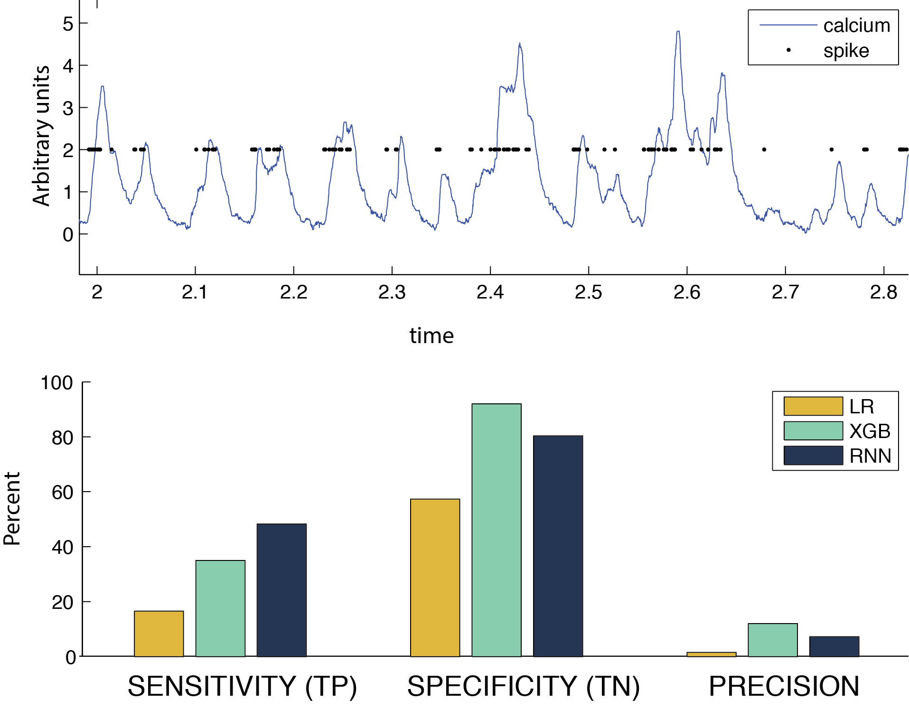
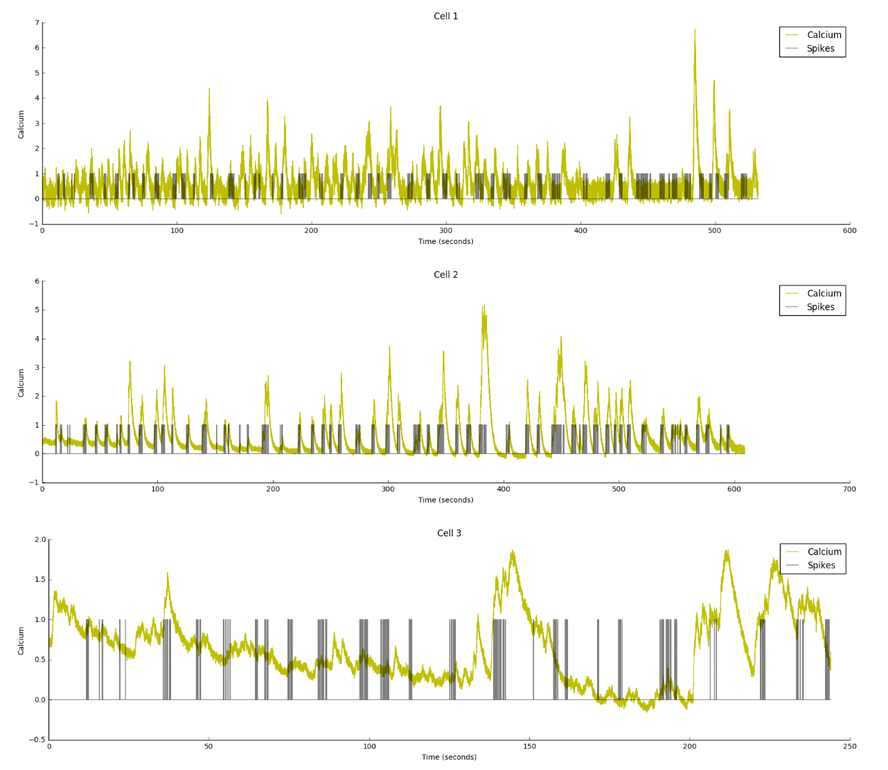
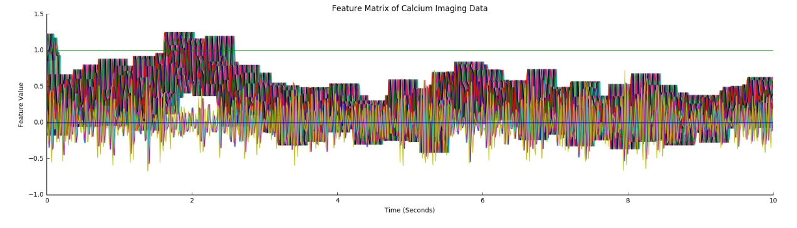
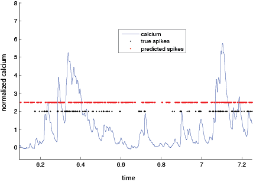
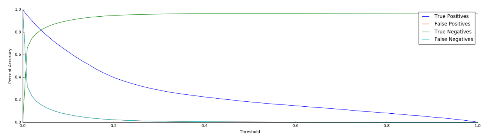
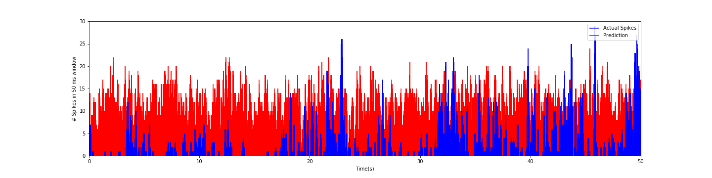
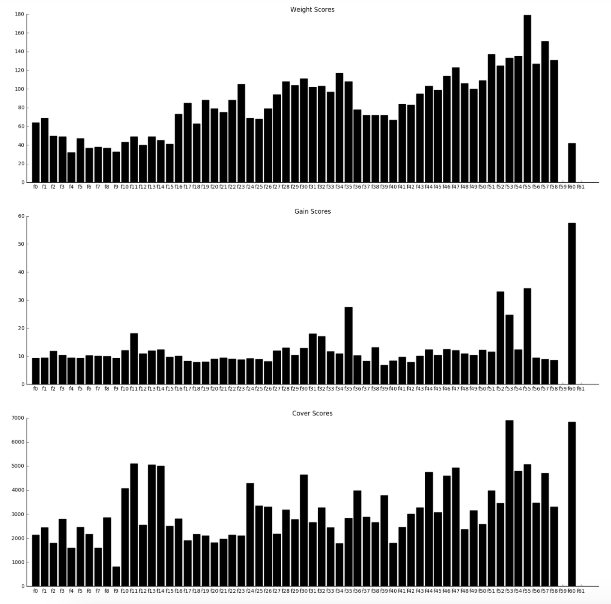

### **Predicting neural spike trains from two-photon calcium imaging**
 
Northwestern University, EECS349 Spring 2017 - Machine Learning  
Maite Azcorra-Sedano, Han Jiang, Torben Noto, Vivek Sagar  
torben.noto@gmail.com
 
 
#### <u>Abstract</u>
 
> Research in neuroscience usually aims to study neuronal activity, or spiking, but measuring spiking is an arduous process that can only be done one cell at a time. A current challenge is determining the spiking of neurons from recordings of features that are related to their firing, but which are naturally noisy and imprecise. Calcium imaging is a popular technique that optically measures intracellular levels of calcium from thousands of neurons simultaneously, but despite the several advantages of calcium imaging, it suffers from the drawback that the calcium levels only provide a proxy for neuronal firing. Even though there is a strong biophysical framework to explain how neuronal firing relates to calcium currents, it is not clear how we can mathematically calculate the neuronal spiking from calcium signals due to factors like limited sampling rates and dye-buffering. A precise and fast algorithm for doing this would help enormously in the understanding of neuronal functions at a larger scale, eliminating the caveat of equating calcium signaling to activity.
>
> Several computational models (deconvolution filters, Bayesian, biophysical and generalized linear models) have been proposed to predict the spike trains from calcium currents, but their estimation necessitates making several assumptions about the mechanism underlying the relationship between calcium currents and neuronal spiking. Here we implemented several supervised machine learning algorithms which do not require such assumptions, including logistic regression, gradient boosting, feedforward neural networks, and recurrent neural networks, to predict spike trains from calcium signals and their derivatives. We obtained different sensitivities, specificities and precisions for the algorithms, and particularly in some cases an appreciable amount of specificity, but none of the algorithms were able to isolate the spikes with high precision. We speculate that this might be due to the heavily skewed data, and to variability in the mapping from the calcium trace to the spike train across neurons. 
>  
>  
> 

> Figure 1. Upper: example time series of calcium signal and concurrent spikes.
>Lower: Sensitivity, specificity and precision of 3 different classifiers: 
>LR (logistic regression), XGB (gradient boosting) and RNN (recurrent neural nets).
 
#### <u> Final Report</u>
 
#### Introduction
The central focus of neuroscientific research is to understand how the biology, activity, and connections between neurons gives rise to cognitive processes. Neurons undergo a stereotyped electrical activity pattern called action potentials, or spiking/firing, to communicate with each other. While measuring spiking in neurons is technically challenging and prohibitively difficult in certain model systems, many prefer to measure other features of neurons that may serve as a proxy for spiking. Calcium imaging is one such popular technique that optically measures intracellular levels of calcium from thousands of neurons simultaneously. There is a strong framework describing the biological processes underlying the relationship between calcium levels and neural spikes, but there are often discrepancies between the biophysical models and data, beyond what would be expected by noise. Some researchers have built [probabalistic models to predict spiking from calcium signals](http://www.sciencedirect.com/science/article/pii/S0896627316300733?np=y), but to our knowledge nobody has attempted to use modern supervised machine learning approaches.
 
#### Data Acquisition and Feature Selection
We obtained a dataset of concurrent calcium and spiking recordings from the [Collaborative Research in Computational Neuroscience (CRCNS) website](https://crcns.org/data-sets/methods/cai-3/about-ret-2). This dataset contains 5 sessions of recording neurons from different parts of the brain using different calcium indicators and under different brain states (described in detail [here](https://crcns.org/files/data/cai-3/crcns_cai-3_data_description.pdf)). Each session contained between 5-21 neurons, and each neuron yielded of the order of 30,000-80,000 time points worth of instances.
 
After examining the data, we observed that calcium traces obtained using different calcium indicators (OGB-1 vs GCaMP6s) were considerably different, as expected given the distinct dynamics of these indicators, so we restricted our data to the indicator GCaMP6s, as it is the more commonly used of the two. This subset of the data that we used (Fig 1.) contained 781082 time points from 13 cells in the mouse retina, and 9 cells in the mouse visual cortex. Spikes are relatively infrequent in neural recordings, this data containing 24301 total spikes (3% of the total time points). This sparsity of positive examples presented a challenge for further analysis. Furthermore, the sampling rate of the recordings (100 Hz) was such that multiple spikes were sometimes binned into single time point, so we chose to binarize the spiking, as otherwise it would add an additional level of complexity to the classification problem.
 

Figure 2. Example calcium (yellow) and spike train (black) traces of 3 cells over time 
 
Several features were then extracted from the preprocessed calcium signals (Fig 3.). For each time point we calculated the instantaneous calcium signal, all of the calcium signals in a range of one second in the future and past, the derivative and the second derivative of the calcium signal, and a sliding window average of calcium activity over 11 increasingly broad windows. Additionally, we included labels for the brain region that the neurons were recorded from and the cognitive state of the mouse.
 

Figure 3. Example of extracted features from calcium signal over time
 
#### Classification Methods 
 
##### Logistic Regression:  
First, as a baseline approach we applied a logistic regression model, which estimates the probabilistic relationship between independent input and dependent output using a logistic function in order to classify spike trains. We empirically chose a regularization parameter between L1 and L2 by calculating precision of the training model over all lambdas between 0 and 1, with step size .05, and choosing the lambda with the highest precision. Then we used the output model from the best lambda to classify labels of the independently drawn test dataset. Code for logistic regression can be found [here](https://github.com/heidijiang/EECS349/tree/master/logreg), implementing algorithms from [here](https://github.com/sth4nth/PRML/tree/master/chapter04).
 
##### Gradient Boosting:  
We built a gradient boosted decision tree classifier using XGBoost and TensorFlow. This classifier builds many weakly accurate, shallow decision trees and combines their predictions into an ensemble that can be fairly accurate. We used a binary, sigmoidal loss function and optimized several important hyperparameters (L1 regularization, L2 regularization, gamma - an entropy-like metric for splitting decisions, and learning step size) of the model to improve performance. All code for training and optimizing gradient boosted trees can be found [here](https://github.com/torbenator/calcium_spikes).
 
##### Recurrent and Feedforward Neural Network:  
The idea is that the history of the calcium activity affects the probability of observing a spike. Keeping this in mind, we implemented an LSTM (using TensorFlow) that takes the previous history of two seconds as the input. The RNN has 64 units, that takes inputs in 10 chunks, each chunk containing 20 time points. The data was fed in batches of size 128 and the network was run for 10 epochs for each of the 5 folds in cross validation. We implemented a dropout of 0.8 for regularization. The value of the dropout was chosen to provide the best possible value of recall in the test data. We used cross entropy with logits as the cost function and penalized the network for using a large number of predicted spikes.  
 
We had also implemented a feedforward neural network. Due to the skewness in the data and the inappropriate cost function, it acted like a ZeroR. The code for the neural nets can be found [here](https://github.com/viveksgr/RNN-for-calcium-imaging/tree/master/Scripts). 
 
#### Results
 
##### Logistic Regression
Logistic Regression obtained a total accuracy of 55.7%, with a true positive/recall rate of 16.54%, true negative rate of 57.3%, and a precision of 1.52%. A chi square test revealed total accuracy to be highly significant relative to chance of 50% χ² (1,155654) = 1030.6, p < .0001. Though this result is highly significant, the logistic regression suffered from an extremely high false positive rate, as can be seen in the below figure. 

 
##### Gradient Boosting
Gradient boosting achieved a total accuracy of 90% with a true negative rate of 92%,
 true positive rate of 35%, and precision of 12%. The hyperparameters that achieved this were: binary logistic classification objective function, with sum of squares error, eta of 1, 0.1 L1 regularization, 0.1 L2 regularization, 0 gamma, max depth of 5, and 50% column sample by tree. Outputs of this objective function were probabilities and manipulating the thresholds achieved different precision and accuracies. The above accuracies were obtained using a rounding threshold of 0.1 (see figure below). While worse than ZeroR (97% accuracy), the result of this model was highly significant relative to chance χ² (1,156217) = 129243, p < 0.0001. 

##### RNN
The total accuracy for RNN was 78.1%. The recall rate (percentage of spikes correctly predicted) was 48.5%. However, RNN had a high false positive rate, evident from the following figure. We believe that RNN did not work properly because the model was optimizing the cost function (and hence, both accuracy and recall) by creating a number of false positives.  

 
#### Discussion
We were not very successful predicting spiking from calcium currents using logistic regression, FFN, RNN, and gradient boosted trees. The source of most of the errors appeared to be in the data. We realized that there were spikes at time points that didn’t look reasonable. Such low predictive power was obtained due to the sparsity and unreliability of the data. However, despite this imposing challenge our models outperformed chance. By investigating the feature importance scores for the gradient boosted trees we can glean insights into the relationship between calcium imaging and spiking. The feature that provided on average the most information gain and that was split on the most was the brain region that the neuron was recorded from (f60). This supports the idea that calcium dynamics are not identical from one neuron to the next, but may be somewhat specific to cell type and cellular environment. More surprisingly, simultaneous calcium level (f0) was not a particularly useful feature for predicting spiking (Pearson's r value of 0.10): it was the calcium currents preceding and following a given time point which were relied upon in this model (f17-57). Even calcium at times 200 ms before spikes (f53) was a particularly strong contributor to prediction accuracy. 
 

 
###### Contributions
Maite Azcorra-Sedano: FFN, Han Jiang: LR, website, Torben Noto: XGB, Vivek Sagar: RNN, all: final writeup
 
